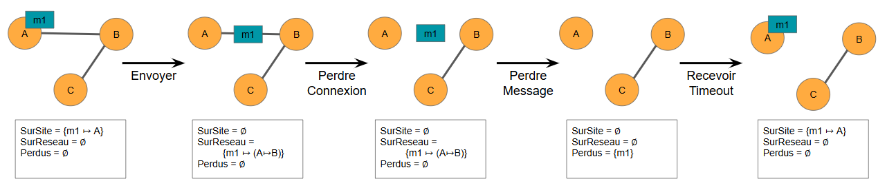

# 📘 Formal Systems Development Project (DSR)


## 📌 Project Overview

This project was carried out as part of a course on **Formal Development of Systems**.
Its main objective is to model, specify, and verify system behavior using formal methods.

The project focuses on the rigorous design of systems through:

* Formal specifications
* Step-by-step refinement
* Verification of system properties (correctness, consistency)

---

## 🎯 Objectives

* Apply formal methods to model a system precisely
* Ensure system correctness through mathematical reasoning
* Validate system behavior using formal tools and proof techniques

---

## 🧠 Methodology

The development process follows a structured approach:

1. **System Modeling**
   Definition of system variables, states, and invariants

2. **Formal Specification**
   Description of system behavior using formal language

3. **Refinement**
   Progressive transformation from abstract model to concrete implementation

4. **Verification**
   Proof of correctness using invariants and logical constraints

---

## 🛠️ Technologies & Tools
- Event-B formal method
- Rodin Platform (Event-B modeling and proof environment)
- Mathematical proof obligations and verification tools
---

## 📂 Project Structure

```
DSR_Project/
│── ctx_*       # Context definitions
│── exemple_*   # Example models
│── DSR_*       # Refinement
```

---

## 📊 Key Features

* Formal modeling of system states and transitions
* Use of invariants to ensure system consistency
* Stepwise refinement ensuring correctness at each stage
* Verification of system properties

---

## 🚀 Learning Outcomes

Through this project, the following skills were developed:

* Understanding of formal methods in software engineering
* Ability to model complex systems rigorously
* Experience with system verification techniques
* Structured and logical problem-solving approach

---

## 🎬 Demo

This project is based on formal modeling using the Rodin Platform.

To explore the project:

1. Open the project using *Rodin* Platform
2. Load the `.bpr` / `.bps` files
3. Explore contexts and machines
4. Run proof obligations to verify system correctness

## 📎 Notes

This project is academic and focuses on **methodology and correctness** rather than user interface or production-ready software.

---

## 👩‍💻 Author

Yige YANG  &  Ninon Autefage-Pinies

Engineering Student (Bac +5) – ENSEEIHT

---

## 📸 Screenshots


### Simple Send


### Message lost


### Message lost


### Complete Send


### Example of a routing table (Cache)


### Example of a RREQ broadcast


### example of a RREP response


### Scenario of loss of a RREQ with a "bridge" site
